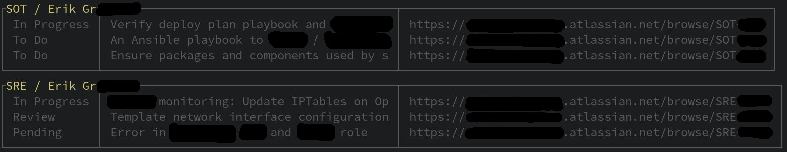

# jira CLI

List jira issues from the terminal



# Usage

Edit the filters to match your organisation.
Set (or export) the following env variables:

JIRA_API_USER  .......  This is your email address
JIRA_API_TOKEN  ......  This can be generated from 
                        account settings -> security -> manage api tokens

call with:

```
JIRA_API_USER=chookity.pok@boop.the.snoot JIRA_API_TOKEN=chookitypokboopthesnoot ./j_issues.py <arg1> .. <argN>
```

Protip, you probably want to alias this in your shellrc:

```
alias jira='JIRA_API_USER=fgs.fgs@foo.bar JIRA_API_TOKEN=blorp /path/to/jiracli.py'
```

Currently supported args:

```
--team   .............  Include issues for the whole team
--active  ............  Filter out issues with 'inactive' statuses or group by active sprints with --sprint option
--inactive  ..........  Filter out issues with 'active' statuses or group by inactive sprints with --sprint option
--sprint  ............  Group issues by 'sprint'.
```
